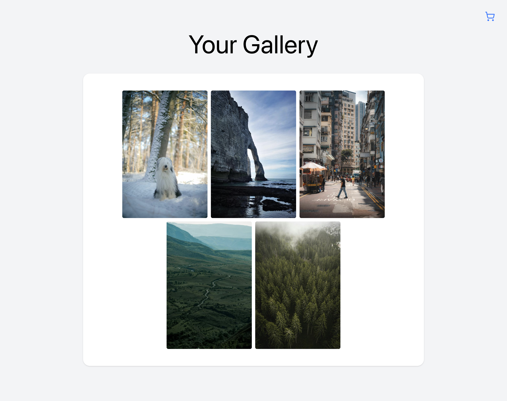
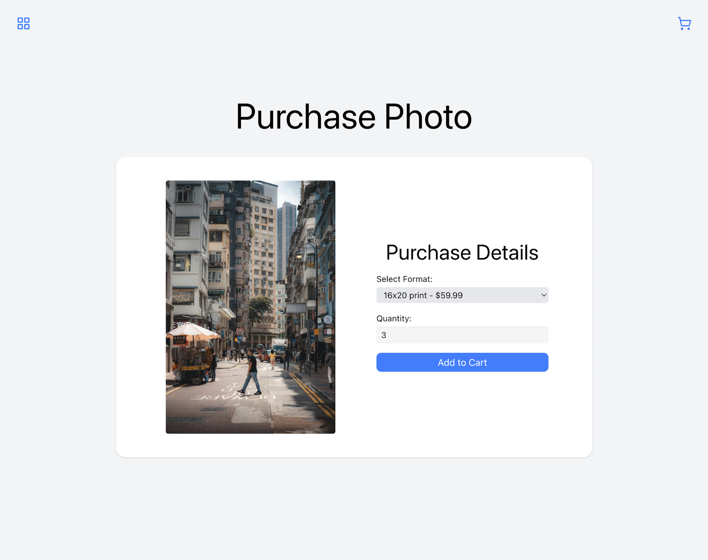
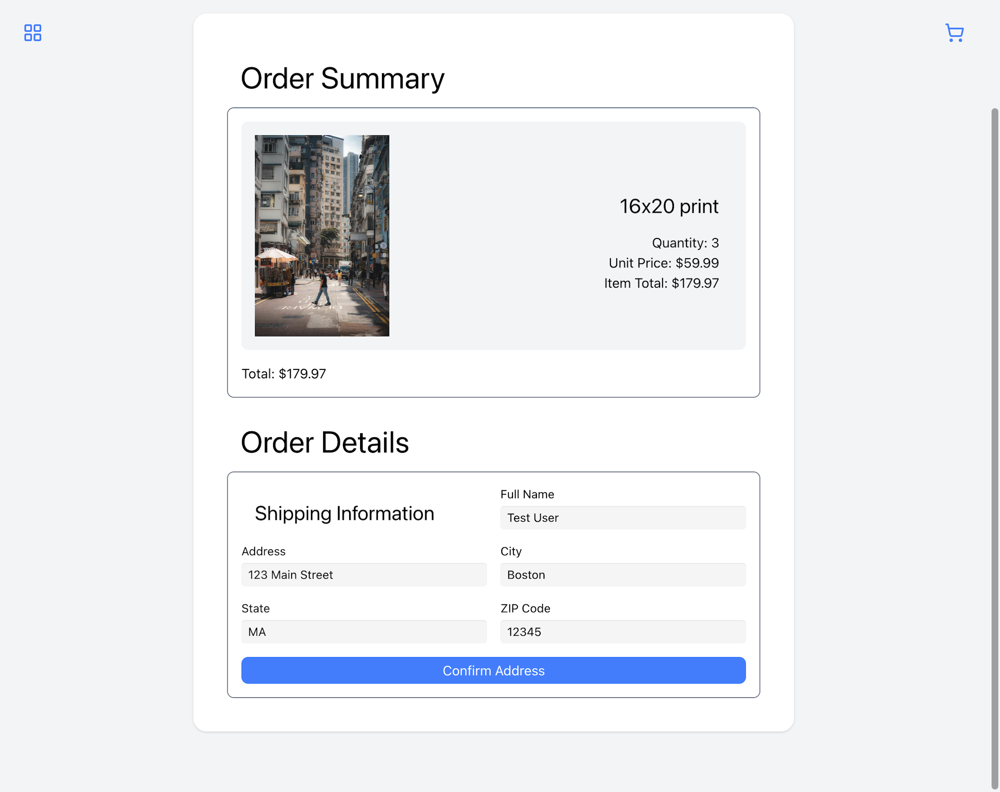
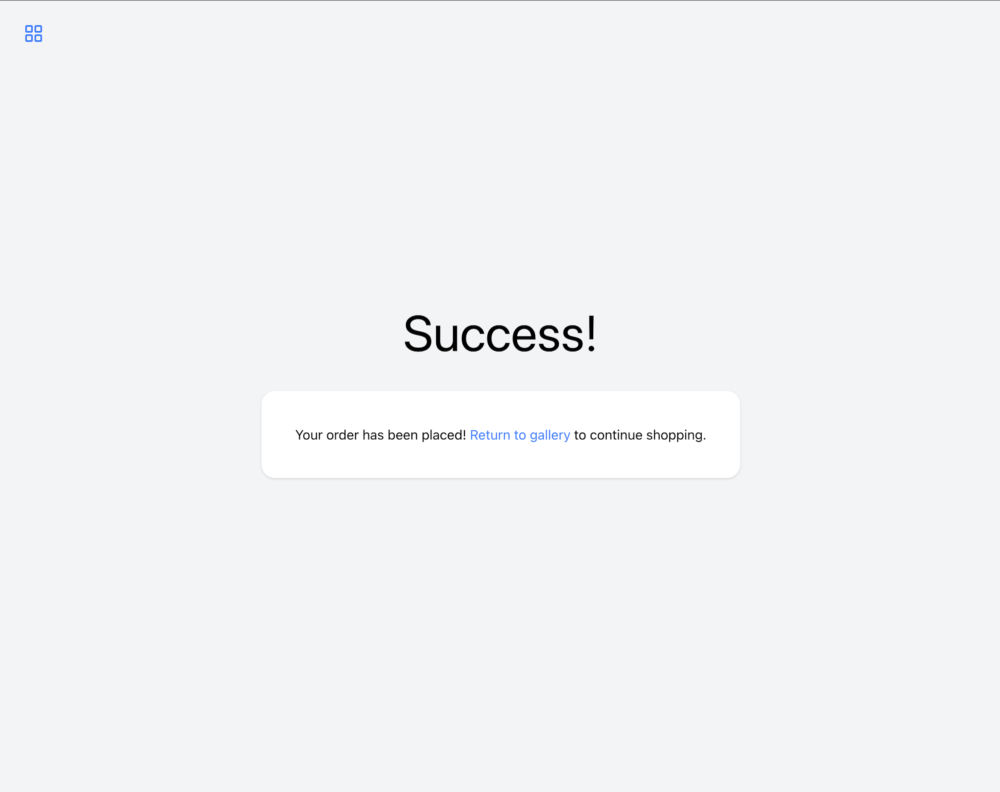

# Photoview API

A REST API for a photography e-commerce platform with shopping cart, payment processing, and image management.

## Demo

[Live Demo](https://photoview.annikaharmsen.com/)

### Screenshots

| Login | Gallery | Purchase Options |
|-------|---------|------------------|
|  |  |  |

| Cart | Shipping | Payment | Success |
|------|----------|---------|---------|
|  |  |  |  |

## Features

- User registration and session-based authentication
- Image upload with automatic optimization (GD Library resizing)
- Shopping cart management (add, update, remove items)
- Multiple print format options (8x10, canvas, etc.)
- Order processing with shipping address handling
- Stripe payment integration with webhook-based transaction tracking
- Dual database support (SQLite for development, MySQL for production)

## Tech stack

**Backend**
- PHP 8.0+ with strict typing
- PDO for database abstraction with prepared statements
- Custom DB wrapper class (`one`, `all`, `insert`, `run`)
- Stripe PHP SDK v18.0 for payment processing
- GD Library for image resizing
- vlucas/phpdotenv v5.6 for environment configuration

**Architecture**
- File-based routing (standalone PHP endpoints)
- RESTful HTTP method routing via switch statements
- Session-based authentication with database validation
- PSR-4 autoloading with namespaced code (`App\Lib`)
- CORS-enabled for cross-origin API consumption

## Installation

1. Clone the repository:
```bash
git clone https://github.com/annikaharmsen/photoview-api.git
cd photoview-api
```

2. Install dependencies:
```bash
composer install
```

3. Create environment file:
```bash
cp .env.example .env
```

4. Configure your `.env` file:
```env
# Database (set USE_SQLITE=true for local development)
USE_SQLITE=true

# MySQL (for production)
DB_HOST=localhost
DB_NAME=photoview
DB_USER=your_username
DB_PASS=your_password

# Stripe
STRIPE_SECRET_KEY=sk_test_...
STRIPE_PUBLIC_KEY=pk_test_...
STRIPE_WEBHOOK_SECRET=whsec_...
```

5. Set up the database:
   - For SQLite: The `database.sqlite` file will be created automatically
   - For MySQL: Import the schema from your database migrations

6. Configure your web server to point to the project directory

## API endpoints

| Method | Endpoint | Description |
|--------|----------|-------------|
| POST | `/app/register.php` | Register a new user |
| POST | `/app/login.php` | Authenticate user |
| GET | `/app/users.php` | List all users |
| GET | `/app/images.php` | Get user's photos |
| POST | `/app/images.php` | Upload photos |
| GET | `/app/formats.php` | Get available print formats |
| GET | `/app/cart.php` | Get cart items |
| POST | `/app/cart.php` | Add item to cart |
| PATCH | `/app/cart.php` | Update item quantity |
| DELETE | `/app/cart.php` | Remove item from cart |
| POST | `/app/order.php` | Create order and payment intent |
| GET | `/app/stripe.php` | Get Stripe public key |
| POST | `/app/payment_intent_webhook.php` | Stripe webhook handler |

## Usage

### Register a user
```bash
curl -X POST http://localhost/app/register.php \
  -d "name=John Doe" \
  -d "email=john@example.com" \
  -d "password=secret123"
```

### Upload photos
```bash
curl -X POST http://localhost/app/images.php \
  -F "photos[]=@photo1.jpg" \
  -F "photos[]=@photo2.jpg" \
  -F "user_id=1" \
  -F "description=Summer vacation"
```

### Add to cart
```bash
curl -X POST http://localhost/app/cart.php \
  -d "photo_id=1" \
  -d "format_id=2" \
  -d "quantity=1" \
  --cookie "PHPSESSID=your_session_id"
```

## Project structure

```
API/
├── app/
│   ├── config/
│   │   ├── autoload.php    # Composer autoloader + dotenv
│   │   ├── db.php          # PDO connection (SQLite/MySQL)
│   │   └── stripe.php      # Stripe configuration
│   ├── Lib/
│   │   ├── Auth.php        # Authentication helpers
│   │   ├── DB.php          # Database wrapper class
│   │   ├── Image.php       # Image upload/resize utilities
│   │   └── Response.php    # JSON response helpers + CORS
│   ├── cart.php            # Cart endpoint
│   ├── formats.php         # Print formats endpoint
│   ├── images.php          # Photo upload/retrieval endpoint
│   ├── login.php           # Login endpoint
│   ├── order.php           # Order processing endpoint
│   ├── payment_intent_webhook.php  # Stripe webhook
│   ├── register.php        # Registration endpoint
│   ├── stripe.php          # Stripe public key endpoint
│   └── users.php           # Users endpoint
├── uploads/
│   └── optimized/          # Resized images for web display
├── composer.json
└── database.sqlite         # SQLite database (development)
```

## License

This project is licensed under the MIT License - see the [LICENSE](LICENSE) file for details.
